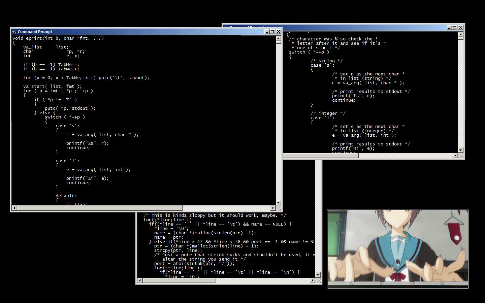

# Description
🚀 Welcome to my Software Engineering Labs Repository! 🧑‍💻

🔎 Here, you'll find a collection of labs, homeworks, and courseworks that encapsulate my journey in 🌈ITMO University🌈

📬 Feel free to DM me in [Telegram](https://t.me/vaneshik) [RUS/ENG] + Subscribe to my [Telegram Channel](https://t.me/+sTL8GeG882VhNDMy) - Van the Hedgehog! 🦔 

# Subjects
[🤓] First year:
* [Programming // Программирование](https://github.com/Vaneshik/VT-Labs/tree/main/java)
* [CSbasic (OPD) // Основы профессиональной деятельности](https://github.com/Vaneshik/VT-Labs/tree/main/csbasic)
* [Informatics // Информатика](https://github.com/Vaneshik/VT-Labs/tree/main/informatics) 

To Be Continued...

# Useful Links
    WIP
